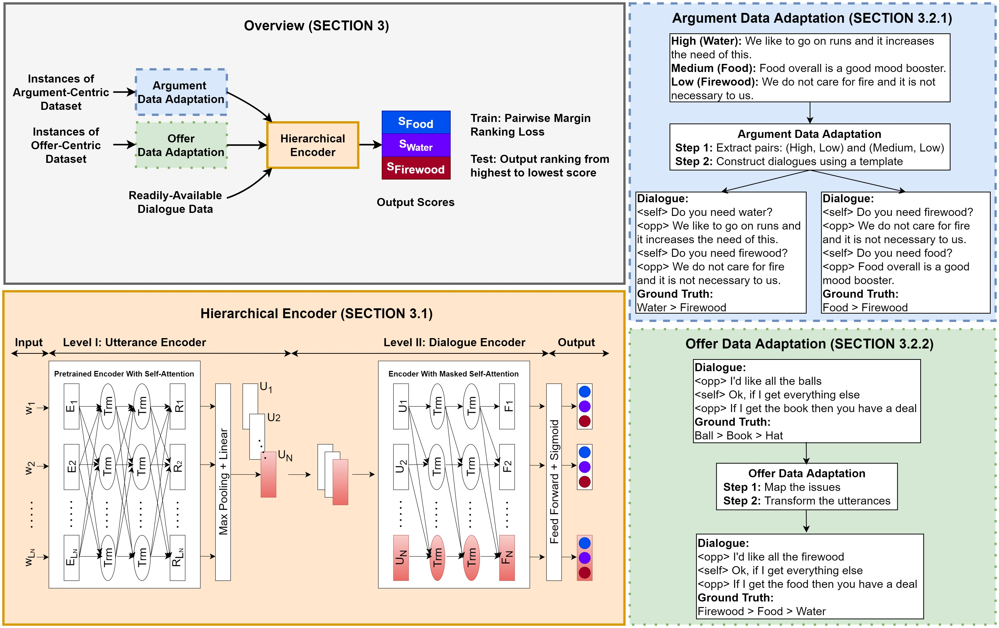

- Title: **Opponent Modeling in Negotiation Dialogues by Related Data Adaptation**  
	
	Authors: **Kushal Chawla**, Gale Lucas, Jonathan May, Jonathan Gratch 
	
	Publication Venue: Findings of NAACL 2022  
	
	Useful Links: <a href="https://arxiv.org/pdf/2205.00344.pdf" target="_blank">Paper</a>, <a href="https://github.com/kushalchawla/opponent-modeling" target="_blank">Code</a>
	
	Abstract: Opponent modeling is the task of inferring another party's mental state within the context of social interactions. In a multi-issue negotiation, it involves inferring the relative importance that the opponent assigns to each issue under discussion, which is crucial for finding high-value deals. A practical model for this task needs to infer these priorities of the opponent on the fly based on partial dialogues as input, without needing additional annotations for training. In this work, we propose a ranker for identifying these priorities from negotiation dialogues. The model takes in a partial dialogue as input and predicts the priority order of the opponent. We further devise ways to adapt related data sources for this task to provide more explicit supervision for incorporating the opponent's preferences and offers, as a proxy to relying on granular utterance-level annotations. We show the utility of our proposed approach through extensive experiments based on two dialogue datasets. We find that the proposed data adaptations lead to strong performance in zero-shot and few-shot scenarios. Moreover, they allow the model to perform better than baselines while accessing fewer utterances from the opponent. We release our code to support future work in this direction.

	
	
 

- **Towards Emotion-Aware Agents For Negotiation Dialogues**  
	**Kushal Chawla**, Rene Clever, Jaysa Ramirez, Gale Lucas, Jonathan Gratch 
	ACII 2021  
	<a href="https://arxiv.org/pdf/2107.13165.pdf" target="_blank">Paper</a>
 

- **CaSiNo: A Corpus of Campsite Negotiation Dialogues for Automatic Negotiation Systems**  
	**Kushal Chawla**, Jaysa Ramirez, Rene Clever, Gale Lucas, Jonathan May, Jonathan Gratch 
	NAACL 2021  
	<a href="https://www.aclweb.org/anthology/2021.naacl-main.254.pdf" target="_blank">Paper</a>
 

Browse my <a href="https://scholar.google.co.in/citations?user=x4rFCskAAAAJ&hl=en" target="_blank">Google Scholar profile</a> or my <a href="https://kushalchawla.github.io/resume/" target="_blank">Resume</a> for a complete publication list.
 
